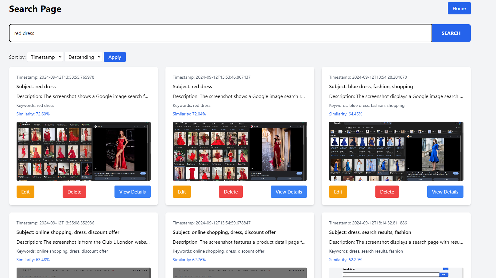

# Charlie Recall

Charlie Recall is a Flask-based web application that captures desktop screenshots at regular intervals, analyzes them using AI, and provides a searchable interface for reviewing the captured images and associated metadata.

## Screenshot



## Features

- Automatic screenshot capture at configurable intervals
- AI-powered image analysis using OpenAI's GPT-4 Vision
- Optical Character Recognition (OCR) for text extraction from images
- Real-time display of captured screenshots and analysis results
- Searchable database of screenshots with metadata
- Ability to edit and delete entries
- Responsive web interface with sorting and pagination

## Prerequisites

- A computer running Windows, macOS, or Linux
- Internet connection

## Installation

1. Install Python:
   - Visit the official Python website: https://www.python.org/downloads/
   - Download the latest version of Python for your operating system
   - Run the installer and follow the installation wizard
   - Make sure to check the box that says "Add Python to PATH" during installation (not on all systems present)

2. Install Git:
   - Visit the official Git website: https://git-scm.com/downloads
   - Download the appropriate version for your operating system
   - Run the installer and follow the installation wizard, using the default settings

3. Open a terminal or command prompt:
   - On Windows: Press Win + R, type "cmd", and press Enter
   - On macOS: Press Cmd + Space, type "Terminal", and press Enter
   - On Linux: Press Ctrl + Alt + T

4. Clone the repository:
   - In the terminal, type the following command and press Enter:
     ```bash
     git clone https://github.com/airobinnet/charlie-recall.git
     ```
   - This will create a new folder called "charlie-recall" in your current directory

5. Navigate to the project folder:
   ```bash
   cd charlie-recall
   ```

6. Create a virtual environment:
   - A virtual environment is a self-contained directory that contains a Python installation for a particular version of Python, plus a number of additional packages. It's used to keep the dependencies required by different projects separate.
   - In the terminal or command prompt, type one of the following commands and press Enter:
     ```bash
     python -m venv venv
     # or
     py -m venv venv
     ```
   - This creates a new folder called "venv" in your project directory, which contains a separate Python installation

7. Activate the virtual environment:
   - Activating the virtual environment ensures that you're using the Python installation and packages specific to this project, avoiding conflicts with other Python projects on your system.
   - On Windows:
     ```bash
     venv\Scripts\activate
     # or
     .\venv\Scripts\activate
     ```
   - On macOS and Linux:
     ```bash
     source venv/bin/activate
     ```
   - After activation, you should see "(venv)" at the beginning of your command prompt, indicating that the virtual environment is active

8. Install the required packages:
   - Make sure you're still in the charlie-recall folder and your virtual environment is activated
   - In the terminal or command prompt, type the following command and press Enter:
     ```bash
     pip install -r requirements.txt
     ```
   - This command reads the requirements.txt file in the project folder and installs all the necessary packages
   - The installation process may take a few minutes, depending on your internet connection
   - You'll see a lot of text scrolling by as packages are downloaded and installed
   - Wait until the process is complete and you see the command prompt again

9. Create a `.env` file:
   - Open a text editor (like Notepad on Windows or TextEdit on macOS)
   - Create a new file and add the following lines:
     ```bash
     OPENAI_API_KEY=your_api_key_here
     BASE_PATH=/path/to/store/screenshots
     ```
   - Replace `your_api_key_here` with your actual OpenAI API key
   - Replace `/path/to/store/screenshots` with the full path where you want to store screenshots (e.g. `C:\\Users\\CharlieRecall`)
   - Save the file as `.env` in the charlie-recall folder

## Usage

1. Start the application:
   - Make sure you're in the charlie-recall folder and your virtual environment is activated
   - Run one of the following commands:
     ```bash
     python main.py
     # or
     py main.py
     ```

2. The application should automatically open in your default web browser. If it doesn't:
   - Open your web browser
   - Navigate to `http://localhost:5001`

3. Using the application:
   - Click the "Start Capturing" button to begin taking screenshots
   - Click the "Stop Capturing" button to pause the screenshot process
   - Use the "Settings" button to adjust the capture interval
   - Click the "Search" button to open the search page and review captured screenshots

4. To stop the application:
   - Go back to the terminal or command prompt
   - Press Ctrl + C to stop the Python script
   - Deactivate the virtual environment by typing:
     ```bash
     deactivate
     ```
   - This returns you to your system's default Python environment

If you encounter any issues during installation or usage, please check the project's issue tracker on GitHub or seek help from the community.

## Contributing

Contributions are welcome! Please feel free to submit a Pull Request.

## License

This project is licensed under the MIT License - see the LICENSE file for details.